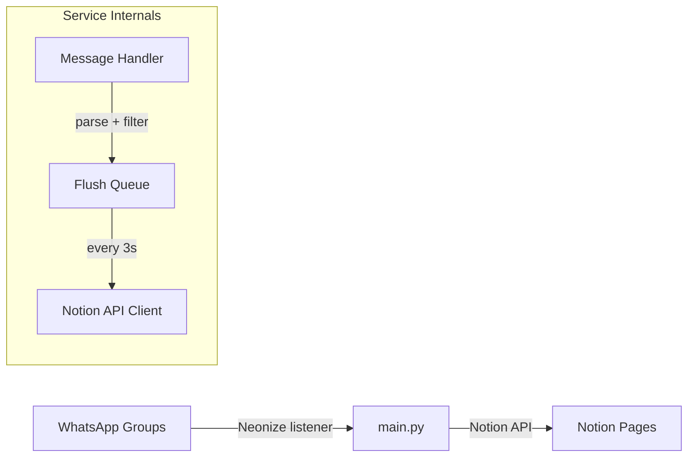

# WhatsApp to Notion Sync

A background Python service that listens to your WhatsApp groups and syncs messages to Notion pages in real time. One-way sync: WhatsApp -> Notion.

## How It Works

The service connects to WhatsApp as a linked device (like WhatsApp Web) using [Neonize](https://github.com/krypton-byte/neonize), a Python wrapper around the [whatsmeow](https://github.com/tulir/whatsmeow) Go library. It listens for messages in groups you configure, then pushes them to Notion via the [Notion API](https://developers.notion.com/).



## Notion Page Structure

The service creates a parent/child page hierarchy in Notion:

```
WhatsApp Sync                  <- you create this page once
|
+-- Inbox                      <- auto-created, one per tracked group
|   +-- [newest message]       <- inserted at TOP, newest first
|   +-- [older message]
|   +-- ...
|
+-- Startups
+-- Movies
+-- Ideas
```

Each message becomes a cluster of Notion blocks:

| Message type | Notion blocks |
|---|---|
| Plain text | Paragraph |
| Text with link | Paragraph + Bookmark (auto-preview) |
| Just a link | Bookmark |
| Image (with/without caption) | Image block (uploaded) + Paragraph |
| Sticker | Image block (uploaded) |
| Document (with/without caption) | File block (uploaded) + Paragraph |
| Video, Audio | Placeholder text `[Video]`, `[Voice note]` |
| Contact card | Paragraph with contact name |
| Location | Google Maps link |

Every message cluster ends with a gray italic annotation line (`Sender · 24 Feb, 2:30 PM`) and a divider.

## Project Structure

```
whatsapp-notion-sync/
├── main.py                # Entry point: load config, wire components, run
├── whatsapp.py            # Neonize event handlers, message parsing
├── notion_sync.py         # Notion API: page creation, block building, file upload, queue
├── config/
│   ├── __init__.py
│   └── settings.py        # Reads NOTION_API_KEY and NOTION_PARENT_PAGE_ID from .env
├── scripts/
│   └── list_groups.py     # One-shot script to discover WhatsApp group JIDs
├── config.yaml            # Your tracked groups (gitignored)
├── config.yaml.example    # Template for config.yaml
├── .env                   # Your Notion secrets (gitignored)
├── .env.example           # Template for .env
├── requirements.txt
└── setup.md               # Step-by-step setup instructions
```

## Quick Start

```bash
# 1. Install
python3 -m venv .venv && source .venv/bin/activate
pip install -r requirements.txt

# 2. Configure secrets
cp .env.example .env
# Edit .env with your Notion API key and parent page ID (see setup.md)

# 3. Link WhatsApp and discover group JIDs
python scripts/list_groups.py                  # all groups
python scripts/list_groups.py "My Community"   # groups in a specific community

# 4. Configure groups
cp config.yaml.example config.yaml
# Paste the JIDs from step 3 into config.yaml

# 5. Run
python main.py
```

On first run, the service auto-creates Notion child pages for each group and writes their `notion_page_id` back to `config.yaml`. From then on it just listens and syncs.

See [setup.md](setup.md) for detailed step-by-step instructions.

## What's NOT Built

- No media download for video/audio (text placeholders only)
- No web UI -- Notion is the UI
- No reply threading or message edit sync
- No two-way sync (WhatsApp -> Notion only)
